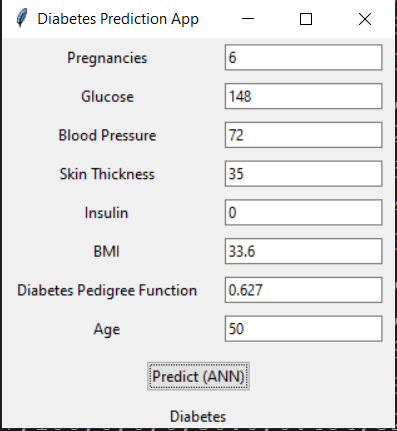

# Diabetes Detection with ANN

This repository contains an implementation of an Artificial Neural Network (ANN) for the purpose of predicting diabetes based on various health metrics.

## Overview

The application takes into consideration various health parameters including:

- **Pregnancies**
- **Glucose**
- **Blood Pressure**
- **Skin Thickness**
- **Insulin**
- **BMI (Body Mass Index)**
- **Diabetes Pedigree Function**
- **Age**

Using these parameters, the ANN model predicts the likelihood of an individual having diabetes.

## Model Performance

- **Training Accuracy**: 83%
- **Validation Accuracy**: 80%

## Dataset

The model is trained on the [Pima Indians Diabetes Database](https://www.kaggle.com/datasets/uciml/pima-indians-diabetes-database) from Kaggle.

## Usage

1. Clone the repository:

`git clone https://github.com/MohammadAminDHM/Diabetes-Detection-with-ANN.git)https://github.com/MohammadAminDHM/Diabetes-Detection-with-ANN.git`

2. Navigate to the project directory and install required packages (assuming you're using pip):

`cd Diabetes-Detection-with-ANN`

`pip install -r requirements.txt`

3. Run the application (specific command based on how you've set it up, e.g., `python app.py`)
4. also you can access to my notebook in my kaggle account [NoteBook](https://www.kaggle.com/code/aminaidhm23386/diabetes-prediction-with-ann). please upvote my note book :)
   
## Future Improvements

- Implement more advanced models for better accuracy.
- Incorporate more parameters to improve prediction capability.
- Provide a user-friendly GUI for easy interaction.
